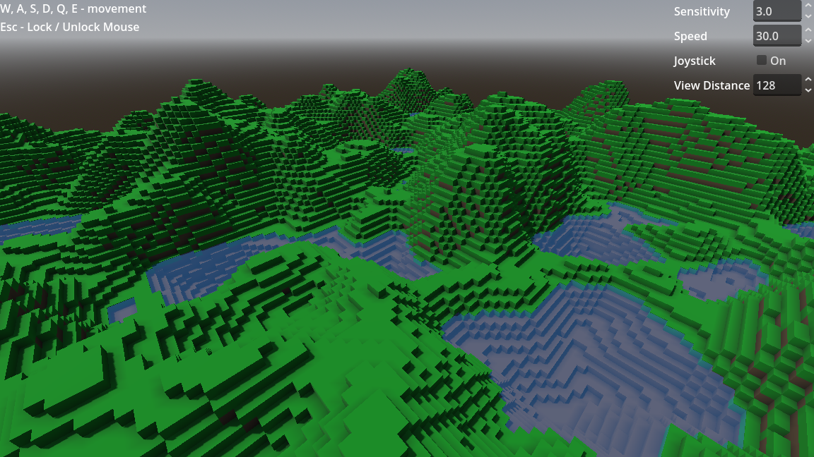
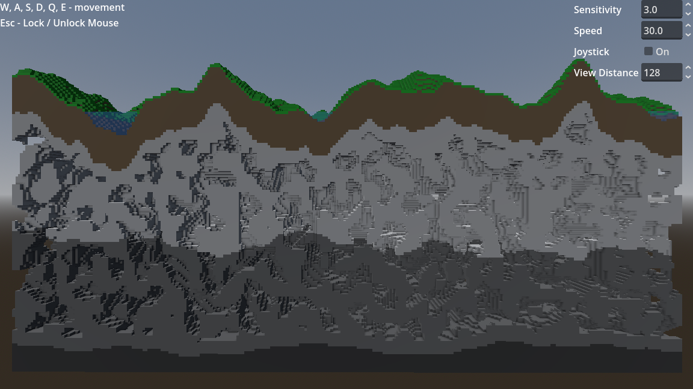
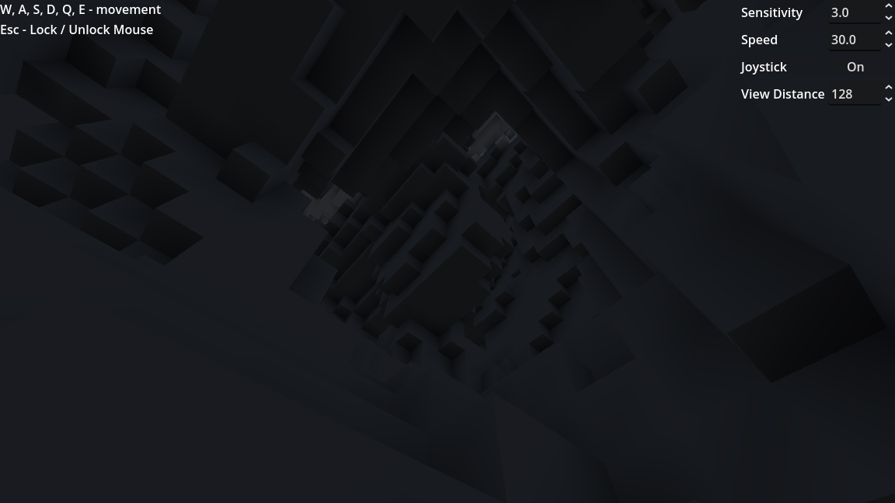

# Layered World Generation

An example of a procedurally generated blocky voxel world using [Voxel Tools for Godot](https://github.com/Zylann/godot_voxel).

## 🌐 Web

Try in your browser: TODO

## 📸 Screenshots

## ✨ Features

- Graphs only generation
- Layered world of different blocks
- Caves

## 🔄 Compatibility

- Godot - 4.4.1+
- Voxel Tools - 1.4.1+

## 🧩 Used Addons

- [Godot Virtual Joystick](https://github.com/MarcoFazioRandom/Virtual-Joystick-Godot)